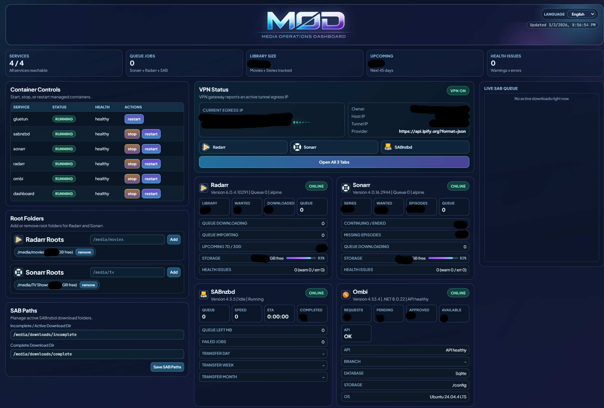

# MOD - Media Operations Dashboard (ARR)

<p align="center">
  
</p>

Web dashboard to monitor and operate a VPN-routed ARR stack:
- Gluetun
- SABnzbd
- Sonarr
- Radarr
- Ombi

## Dashboard Preview

<p align="center">
  
</p>

## Update Feed (Newest First)

### Unreleased
- No pending changes yet.

### `v1.2.0` - 2026-03-04
- Replaced first-run onboarding lock with an always-available `/settings` page.
- Added persistent settings save/apply flow (`GET /api/settings`, `POST /api/settings/save`).
- Added dashboard shortcut link to Settings.
- Settings can now be edited and saved at any time without blocking dashboard APIs.

### `v1.1.0` - 2026-03-03
- Introduced the new dashboard UI and updated documentation.
- Added automatic required-folder initialization for the stack.

### `v1.0.0` - 2026-03-01
- Initial release of MOD (Media Operations Dashboard ARR stack).


## Quick Start

### 1) Prerequisites
- Docker
- Docker Compose
- A WireGuard config file from your VPN provider

### 2) Configure Environment
- Copy `.env.example` to `.env`
- Edit `.env` values as needed
- Set `VPN_WG_CONF` to your local WireGuard file path

### 2.1) WireGuard Config (Required)
- Download a WireGuard profile (`.conf`) from your VPN provider dashboard.
- Put the file in this repo, for example: `./vpn/wg0.conf`
- In `.env`, set:

```env
VPN_WG_CONF=./vpn/wg0.conf
```

- The path is relative to the project root (`docker-compose.yml` location).
- Do not commit this file (it contains private keys).
- If startup fails, check VPN logs:

```bash
docker compose logs --tail=200 gluetun
```

Quick check: a valid file usually contains sections like `[Interface]` and `[Peer]`.

### 3) Start the Stack
```bash
docker compose up -d --build
```

### 4) Open the Dashboard
- Dashboard URL: `http://localhost:8090` (default from `.env.example`)
- Settings URL: `http://localhost:8090/settings`

### 5) Configure Web Settings (Any Time)
- Open `/settings` and set `Media Base Path` (default `/media`) to derive:
  - Radarr root folder (`/media/movies`)
  - Sonarr root folder (`/media/tv`)
  - SAB incomplete + complete directories
- Optional: disable base-path derivation and provide custom paths.
- Auto-connect actions (enabled by default):
  - Configure Radarr/Sonarr SABnzbd download clients
  - Configure Ombi Radarr/Sonarr integration endpoints
- Optional: set VPN heuristics (`HOME_PUBLIC_IP`, expected IPs, org keywords).
- Save settings to apply changes immediately.

### 5.1) Change Root/Download Folders To A Custom PC Path
Important: the settings page writes container paths (for example `/media/movies`), not raw Windows host paths.

If you want a different host folder (for example `D:/MediaLibrary`), update Docker bind mounts in `docker-compose.yml` first so containers can access it.

Example bind mounts to change:
- `./media:/media` -> `D:/MediaLibrary:/media`
- `./media/downloads:/downloads` -> `D:/MediaLibrary/downloads:/downloads`

Apply the same `/media` host mapping for every service that uses media paths (`init_dirs`, `sabnzbd`, `sonarr`, `radarr`, `dashboard`).

After editing bind mounts:
1. Restart/rebuild stack:
   ```bash
   docker compose up -d --build
   ```
2. Open `/settings` and save the desired container paths (for example `/media/movies`, `/media/tv`, `/media/downloads/...`).

### 6) What Is Still Manual
The settings page automates paths and core app-to-app links, but these items still need manual setup:

- Configure each app's remaining credentials and provider/indexer/media-server connections in their own UIs.
- Use `127.0.0.1` or `localhost` with each service port when connecting apps locally.

After saving settings, quickly verify in each app UI that:
- SAB category mapping is correct (`movies` for Radarr, `tv` for Sonarr by default).
- Root folders are present and writable.
- Test downloads/imports work end-to-end.

## Important Notes
- Do not commit secrets (`.env`, WireGuard configs, API keys).
- Runtime data (`config/`, `media/`, `backups/`) is intentionally gitignored.
- First startup may take a bit while containers initialize.
- Required root folders are auto-created by the `init_dirs` service when you run `docker compose up`.

## Main Files
- `docker-compose.yml`
- `.env.example`
- `dashboard_app/`
